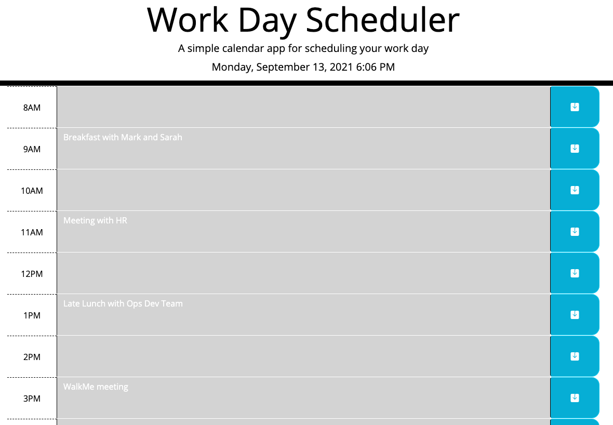

# Work Day Schedule Manager

  

  ## Description

  This a simple, static application that allows a user to maintain a daily schedule. Using jQuery, Bootstrap, and CSS the app will help the user keep aware of their current task and any remaining tasks for the work day. 

  

  ## Live APP

  To see this app in action, click [here](https://crawleyj2.github.io/work-day-mgr/).

  ## Questions

  If you have questions about this project please contact me at [crawleyj2@gmail.com](mailto:crawleyj2@gmail.com).
  More of my work can be found on GitHub at [crawleyj2](https://github.com/crawleyj2)